# Xcode Shortcut

  
Table of Contents

  <ol>
    <li>
      <a href="#toggle-minimap">Toggle Minimap</a>
    </li>
    <li><a href="#editor">Editor</a></li>
      <ul>
        <li><a href="#focus-editor">Focus Editor</a></li>
        <li><a href="#find-the-function-caller">Find the function caller</a></li>
        <li><a href="#show-document-items">Show document items</a></li>
      </ul>
    <li><a href="#editors-tab">Editor's tab</a></li>
      <ul>
        <li><a href="#switch-tab">Switch Tab</a></li>
        <li><a href="#open-new-editor-on-the-right">Open New Editor on the right</a></li>
        <li><a href="#close-current-editor">Close current editor</a></li>
      </ul>
    <li><a href="#code-editing">Code Editing</a></li>
      <ul>
        <li><a href="#code-completion">Code Completion</a></li>
        <li><a href="#re-indent">Re-indent</a></li>
        <li><a href="#comment-the-code">Comment the code</a></li>
      </ul>
    <li><a href="#navigation">Navigation</a></li>
      <ul>
        <li><a href="#jump-to-definition">Jump to Definition</a></li>
        <li><a href="#find-call-hierarchy">Find Call Hierarchy</a></li>
        <li><a href="#find-select-symbol-in-project">Find Select Symbol in Project</a></li>
        <li><a href="#open-quickly">Open Quickly</a></li>
        <li><a href="#highlight-file-in-project-navigator">Highlight File in Project Navigator</a></li>
      </ul>
  </ol>

# Mac keyboard symbols

| ⌘ = Command | ⌥ = Option/Alt     | ⇧ = Shift |
|-------------|--------------------|-----------|
| ⌃ = Control | ←→ ↑↓ = Arrow keys | ↩ = Enter |

## Toggle Minimap

- (⌃ Control) + (⇧ Shift) + (⌘ Command) + M
- Alternative: Editor > Minimap

	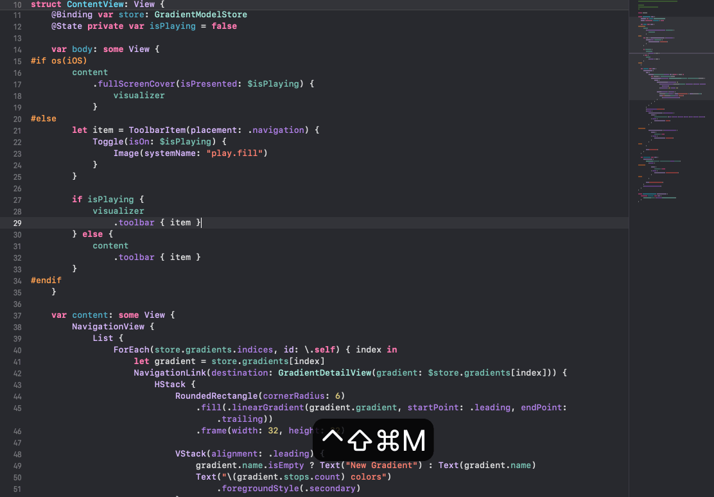

## Editor

### Focus Editor

- (⌘ Command) + (⌃ Control) + (⇧ Shift) + ⏎ Return
- Alertnative: View > Editor > Focus/Hide Focus

Juggling multiple editors is a common challenge. While sometime I will have multiple editors open for reviewing, when I need to focus on one specific editor I also don't want to close others. This shortcut becomes really handy. Ensuring that the editor you need is always at the forefront.

	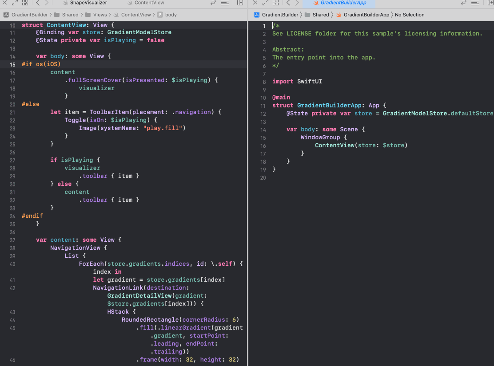

------

### Find the function caller

- Prerequisite: The function needs to be highlighted.
- (⌃ Control) + 1 -> Move to caller tab

I often use this shortcut while knee-deep in a giant codebase for some complicated function or business logic. Instead of manually combing through the project to discover its various callers, with this shortcut, I can seamlessly navigate to the caller tab. And gain a deeper understanding of the project's architecture.

	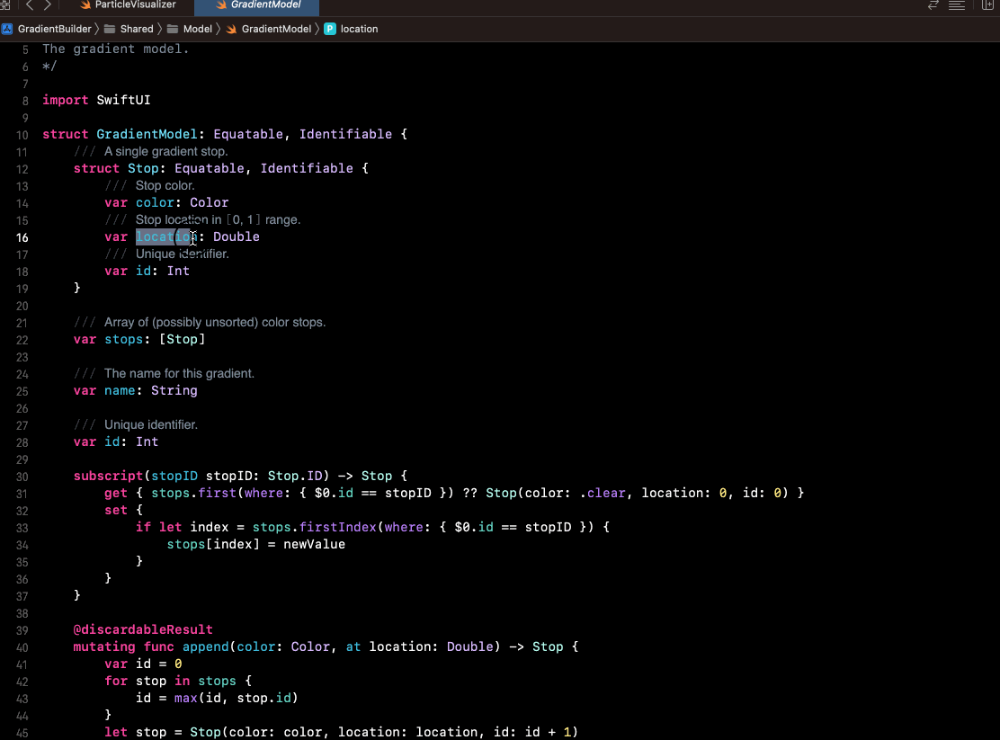

------

### Show document items

- (⌃ Control) + 6

This shortcut comes handy once we need to check all the functions, variables, classes or extenion etc... in the file. This would open up the tab that helps visualize those in the current file.

	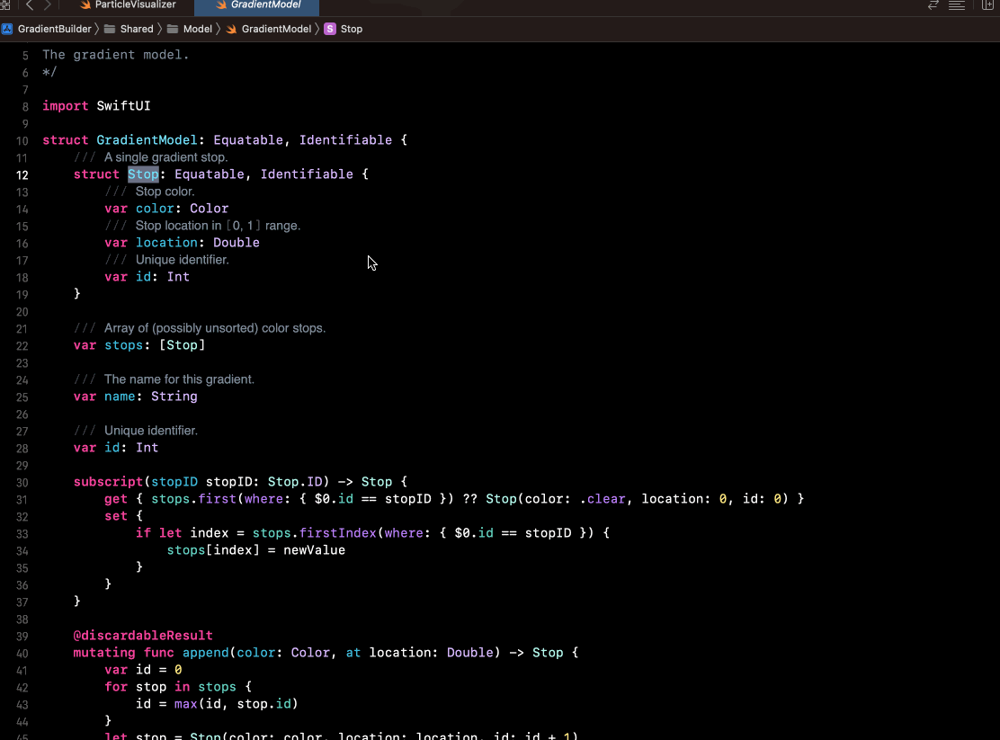

------

## Editor's Tab

### Switch Tab

- (⌘ Command) + (⇧ Shift) + [ (Switch from right to left)
- (⌘ Command) + (⇧ Shift) + ] (Switch from left to right)

If there are multiple tabs in one editor and we want to navigate through the neighbour's tab quickly. This shortcut is the one you are looking for.

	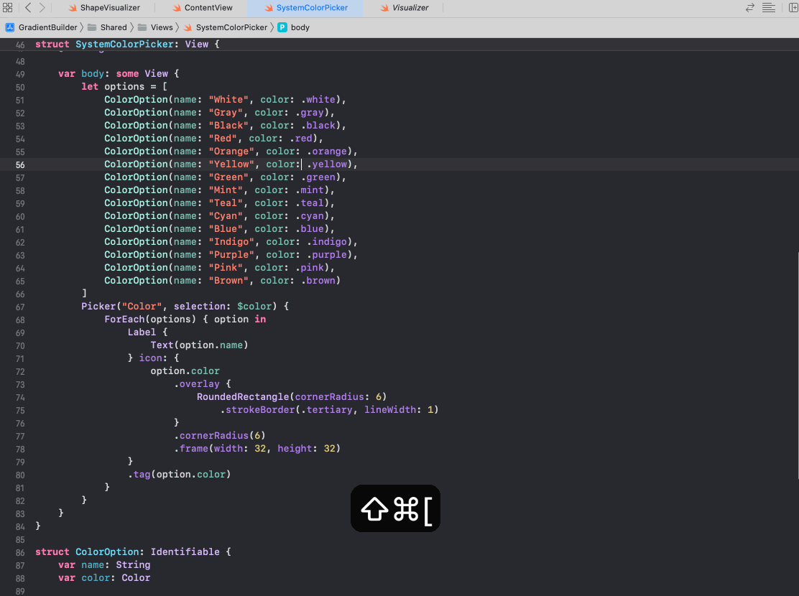

------

### Open New Editor on the right

- (⌘ Command) + (⌃ Control) + T

Whenever we need to add an extra editor, using this shortcut helps us directly open the currently selected file as the new editor and append it to the right side.

	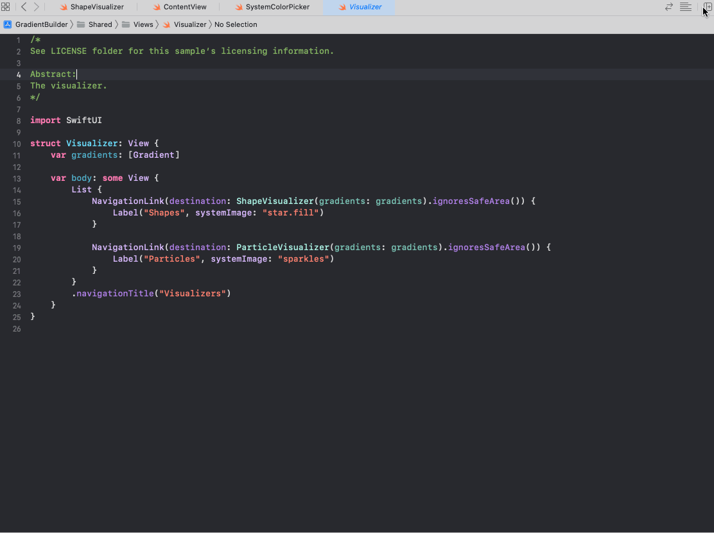

------

### Close current editor

- (⌘ Command) + (⌃ Control) + (⇧ Shift) + W

This shortcut will close the focused Editor.

	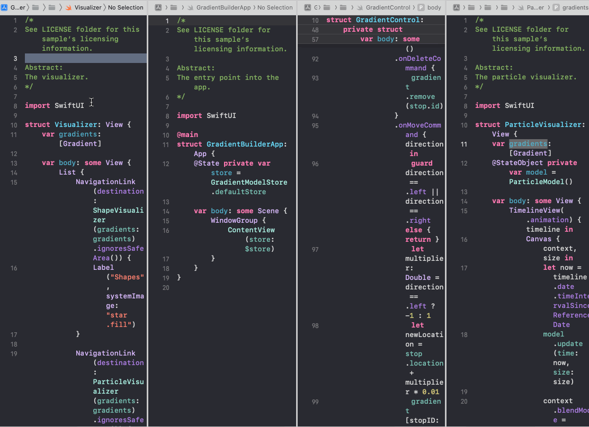

## Code Editing

### Code Completion

- (⌃ Control) + Space

One of my favourite shortcuts while exploring the new field of the codebase. "Show Quick Help" opens a pop-up window displaying quick documentation and information about that specific API or code symbol. This is helpful for exploring the details of APIs, functions, and classes without having to navigate away from current tab.

	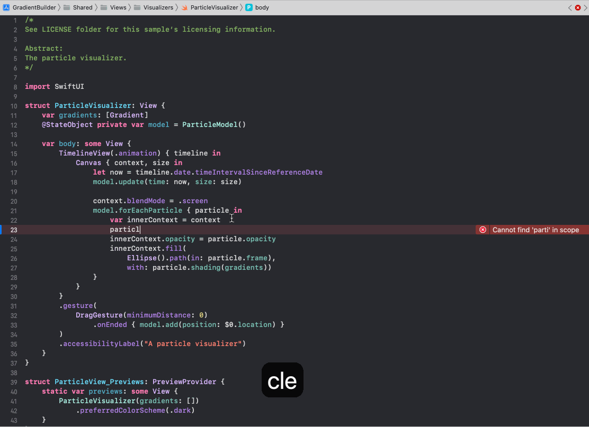

------

### Re-indent

- (⌃ Control) + I

This helps to re-indent the selected area's indent.

	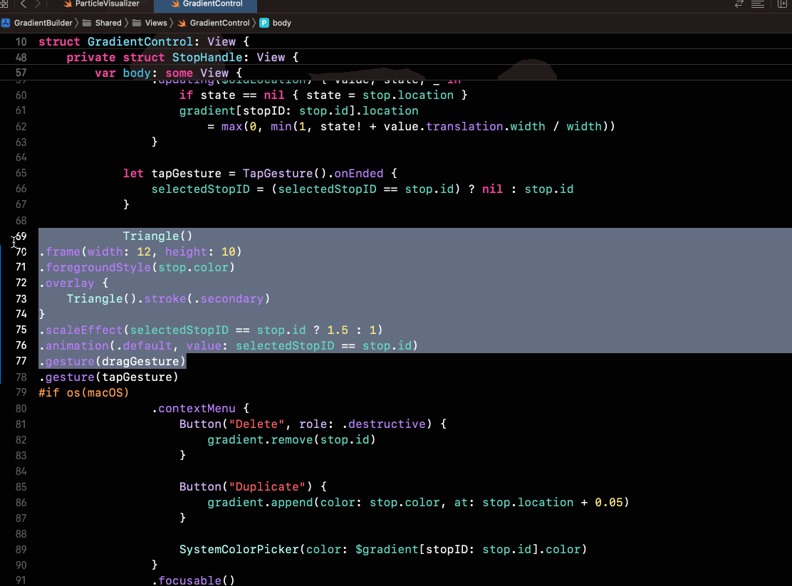

------

### Comment the code

- (⌘ Command) + /

This action adds or removes comment markers, making it easy to annotate your code for clarity or temporarily disable sections during development.

	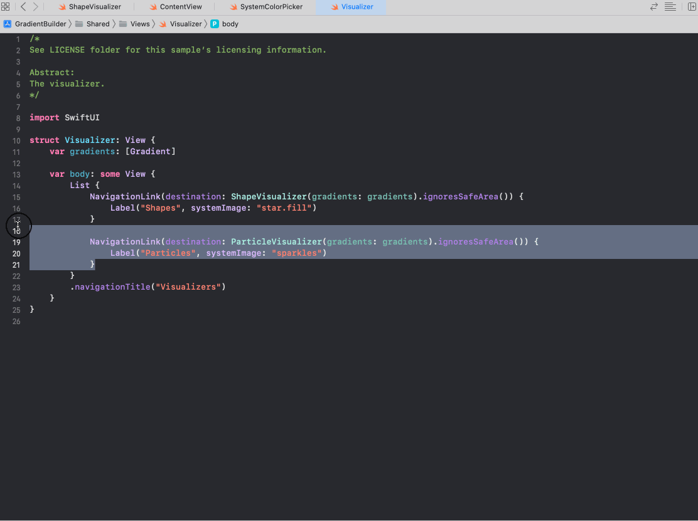

------

## Navigation

### Jump to Definition

- (⌘ Command) + (⌃ Control) + J or (⌘ Command)
- or  (⌃ Control) + Click

With this shortcut it can navigate to the definition of a symbol, function or class. It is often useful when we need to check where symbol, function or class is declared.

	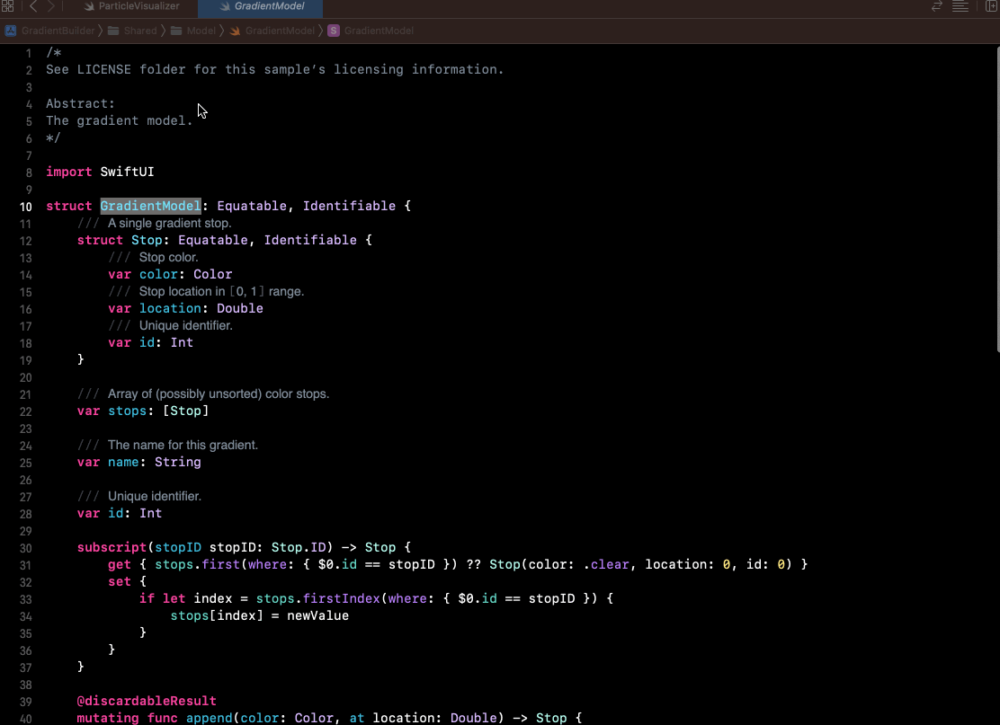

------

### Find Call Hierarchy

- (⌘ Command) + (⌃ Control) + (⇧ Shift) + H

If the function/property that we know is deep nested inside other's propery. Find call Hierarchy help us to visualize the hierarchy of the call.

	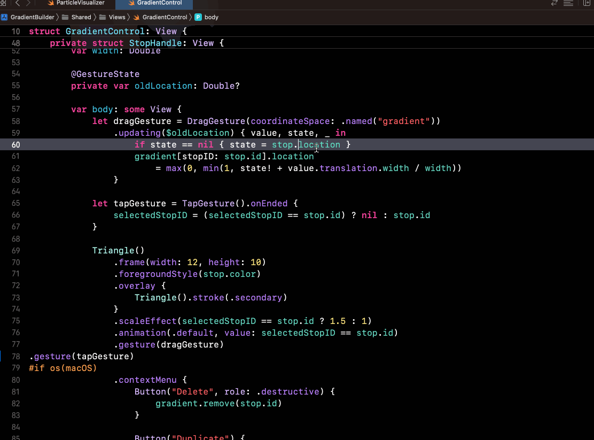

------

### Find Select Symbol in Project

- (⌘ Command) + (⌃ Control) + (⇧ Shift) + F

Normally we will using the (⌘ Command) + F to find the match String in the project. But this won't narrow down to the specific property that we are actually looking for since there might have the chance we have same property called "name".

With this shortcut it will only list the highlighted propery as the result which is quite helpful if we are searching for some properties/function might have same name.

	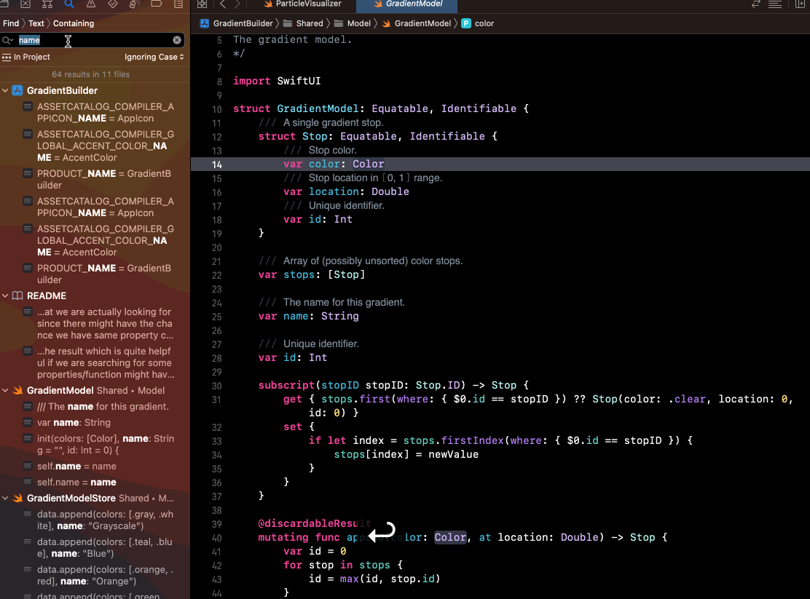

------

### Open Quickly

- (⌘ Command) + (⇧ Shift) + O

This is often used when the developer has a file that is already in mind. By using this shortcut, it prevents the developer from navigating through the whole hierarchy in the project folder.

Sometimes it also used while code reviewing, other developers might have more knowledge of the feature that is being worked on. This shortcut could help the developer sommon the file open on the editor with ease.

	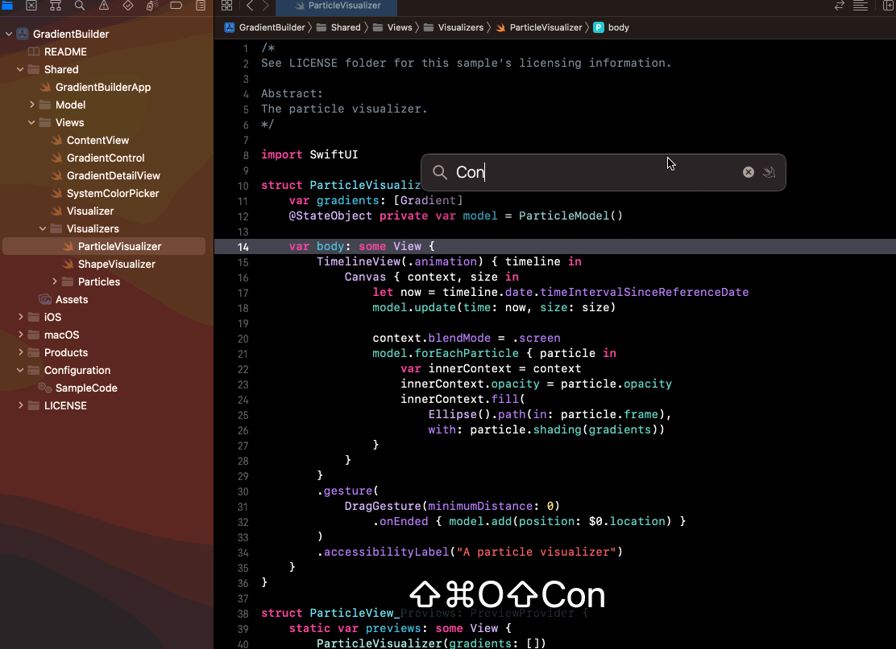

------

### Highlight File in Project Navigator

- (⌘ Command) + (⇧ Shift) + J

When the project has a thousand files, sometimes is hard to find the specific file in the folder. This shortcut is come to rescue for directly highlight the file and navigate deep down to the folder.

	

