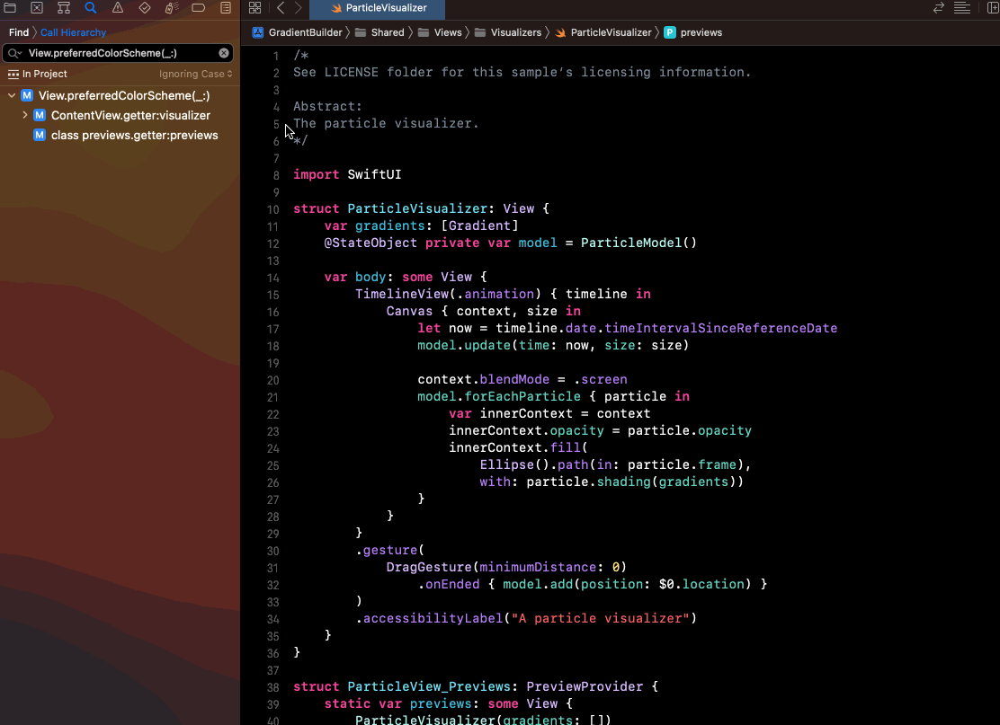

# Xcode Shortcut

# Mac keyboard symbols

| ⌘ = Command | ⌥ = Option/Alt     | ⇧ = Shift |
|-------------|--------------------|-----------|
| ⌃ = Control | ←→ ↑↓ = Arrow keys | ↩ = Enter |

## Toggle Minimap
- (⌃ Control) + (⇧ Shift) + (⌘ Command) + M
- Alternative: Editor > Minimap

	

## Editor

1. **Focus Editor**
	- (⌘ Command) + (⌃ Control) + (⇧ Shift) + ⏎ Return
	- Alertnative: View > Editor > Focus/Hide Focus

Juggling multiple editors is a common challenge. While sometime I will have multiple editors open for reviewing, when I need to focus on one specific editor but I also don't want to close others. This shortcut becomes really handy. Ensuring that the editor you need is always at the forefront.

	

2. **Find the function caller**
	- Prerequisite: The functon need to be highlighted.
	- (⌃ Control) + 1 -> Move to caller tab

3. **Show document items**
	- (⌃ Control) + 6

## Editor's Tab

1.  **Switch Tab**
	- (⌘ Command) + (⇧ Shift) + [ (Switch from right to left)
	- (⌘ Command) + (⇧ Shift) + ] (Switch from left to right)

	

2. **Open New Editor on the right**
	- (⌘ Command) + (⌃ Control) + T

	

3. **Close cuerrent editor**
	- (⌘ Command) + (⌃ Control) + (⇧ Shift) + W

## Code Editing
1. **Code Completion**
	- (⌃ Control) + Space

2. **Re-indent**
	- (⌃ Control) + I

3. **Comment the code**
	- (⌘ Command) + /

	

## Navigation

1. **Jump to Definition**
	- (⌘ Command) + (⌃ Control) + J or (⌘ Command)
	- or  (⌃ Control) + Click

2. **Find Call Hierarchy**
	- (⌘ Command) + (⌃ Control) + (⇧ Shift) + H

3. **Find Select Symbol in Project**
	- (⌘ Command) + (⌃ Control) + (⇧ Shift) + F

4. **Open Quickly**
	- (⌘ Command) + (⇧ Shift) + O

5. **Highlight File in Project Navigator**
	- (⌘ Command) + (⇧ Shift) + J

	

